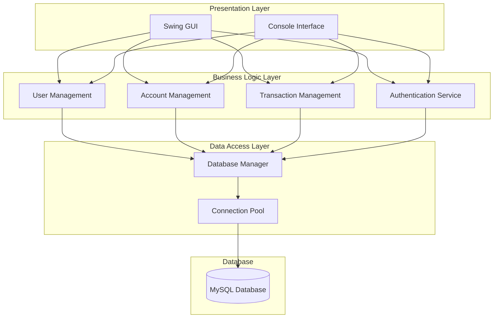
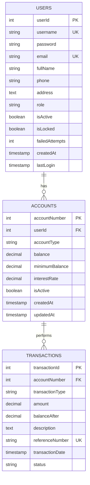

# 🏦 Bank Management System

<div align="center">


**A comprehensive Java-based banking application with GUI and console interfaces**

[Features](#-features) • [Installation](#-installation) • [Usage](#-usage) • [Documentation](#-documentation) • [Contributing](#-contributing)

</div>

---

## 📋 Table of Contents

- [Overview](#-overview)
- [Features](#-features)
- [System Architecture](#-system-architecture)
- [Prerequisites](#-prerequisites)
- [Installation](#-installation)
- [Configuration](#-configuration)
- [Usage](#-usage)
- [API Documentation](#-api-documentation)
- [Database Schema](#-database-schema)
- [Project Structure](#-project-structure)
- [Testing](#-testing)
- [Troubleshooting](#-troubleshooting)
- [Security](#-security)
- [Contributing](#-contributing)
- [License](#-license)
- [Contact](#-contact)

---

## 🎯 Overview

The **Bank Management System** is a robust, feature-rich Java application designed to simulate real-world banking operations. It provides a secure, efficient, and user-friendly platform for managing bank accounts, transactions, and customer data.

### Why Choose This System?

- **🎨 Dual Interface Design**: Choose between an intuitive Swing GUI or a powerful console interface
- **🔐 Enterprise-Grade Security**: Implements password hashing, account locking, and role-based access control
- **📊 Real-time Transaction Processing**: All operations are instantly reflected in the MySQL database
- **📝 Comprehensive Audit Trail**: Every transaction is logged with timestamps for accountability
- **🚀 Scalable Architecture**: Built with clean code principles and modular design for easy extension

---

## ✨ Features

### Core Banking Operations
- ✅ **Account Management**
  - Create new accounts (Savings, Checking, Fixed Deposit)
  - View account details and balances
  - Close/deactivate accounts
  
- ✅ **Transaction Processing**
  - Secure deposits and withdrawals
  - Inter-account fund transfers
  - Transaction rollback capabilities
  
- ✅ **User Management**
  - Customer registration and profile management
  - Admin panel for user administration
  - Role-based access control (Admin/Customer)

### Security Features
- 🔒 **Authentication & Authorization**
  - Secure login with encrypted passwords
  - Session management
  - Account lockout after failed attempts (configurable)
  
- 🛡️ **Data Protection**
  - SQL injection prevention
  - Input validation and sanitization
  - Secure database connections

### Additional Features
- 📊 **Reports & Analytics**
  - Transaction history with filtering
  - Account statements generation
  - Daily/Monthly transaction summaries
  
- 🎨 **User Experience**
  - Intuitive Swing GUI with modern design
  - Responsive console interface
  - Real-time balance updates
  - Help and support system

---

## 🏗️ System Architecture



---

## 📦 Prerequisites

Before you begin, ensure you have the following installed:

| Requirement | Minimum Version | Recommended Version |
|-------------|----------------|-------------------|
| Java JDK | 17 | 17 or higher |
| MySQL Server | 8.0 | 8.0.31 or higher |
| Maven | 3.6 | 3.8.x |
| Git | 2.0 | Latest |
| IDE (optional) | - | IntelliJ IDEA / Eclipse / NetBeans |

---

## 🚀 Installation

### Step 1: Clone the Repository

```bash
git clone https://github.com/2Ntlaks/Bank-Management-System.git
cd Bank-Management-System
```

### Step 2: Set up MySQL Database

1. **Start MySQL server**
```bash
mysql -u root -p
```

2. **Create database and tables**
```sql
-- Create database
CREATE DATABASE IF NOT EXISTS bank;
USE bank;

-- Create users table
CREATE TABLE users (
    userId INT AUTO_INCREMENT PRIMARY KEY,
    username VARCHAR(50) UNIQUE NOT NULL,
    password VARCHAR(255) NOT NULL,
    email VARCHAR(100) UNIQUE,
    fullName VARCHAR(100),
    phone VARCHAR(20),
    address TEXT,
    role VARCHAR(10) NOT NULL DEFAULT 'customer',
    isActive BOOLEAN DEFAULT TRUE,
    isLocked BOOLEAN DEFAULT FALSE,
    failedAttempts INT DEFAULT 0,
    createdAt TIMESTAMP DEFAULT CURRENT_TIMESTAMP,
    lastLogin TIMESTAMP NULL
);

-- Create accounts table
CREATE TABLE accounts (
    accountNumber INT AUTO_INCREMENT PRIMARY KEY,
    userId INT NOT NULL,
    accountType VARCHAR(20) NOT NULL,
    balance DECIMAL(15,2) NOT NULL DEFAULT 0.00,
    minimumBalance DECIMAL(15,2) DEFAULT 0.00,
    interestRate DECIMAL(5,2) DEFAULT 0.00,
    isActive BOOLEAN DEFAULT TRUE,
    createdAt TIMESTAMP DEFAULT CURRENT_TIMESTAMP,
    updatedAt TIMESTAMP DEFAULT CURRENT_TIMESTAMP ON UPDATE CURRENT_TIMESTAMP,
    FOREIGN KEY (userId) REFERENCES users(userId) ON DELETE CASCADE
);

-- Create transactions table
CREATE TABLE transactions (
    transactionId INT AUTO_INCREMENT PRIMARY KEY,
    accountNumber INT NOT NULL,
    transactionType VARCHAR(50) NOT NULL,
    amount DECIMAL(15,2) NOT NULL,
    balanceAfter DECIMAL(15,2) NOT NULL,
    description TEXT,
    referenceNumber VARCHAR(50) UNIQUE,
    transactionDate TIMESTAMP DEFAULT CURRENT_TIMESTAMP,
    status VARCHAR(20) DEFAULT 'completed',
    FOREIGN KEY (accountNumber) REFERENCES accounts(accountNumber) ON DELETE CASCADE,
    INDEX idx_transaction_date (transactionDate),
    INDEX idx_account_number (accountNumber)
);

-- Insert sample admin user (password: admin123)
INSERT INTO users (username, password, fullName, role) 
VALUES ('admin', 'hashed_password_here', 'System Administrator', 'admin');
```

### Step 3: Configure Database Connection

Create or update the database configuration file:

```bash
# Create configuration directory
mkdir -p src/main/resources

# Create database.properties file
cat > src/main/resources/database.properties << 'EOF'
# Database Configuration
db.url=jdbc:mysql://localhost:3306/bank
db.username=root
db.password=your_password_here
db.driver=com.mysql.cj.jdbc.Driver

# Connection Pool Settings
db.pool.size=10
db.pool.timeout=30000
EOF
```

### Step 4: Build the Project

```bash
# Install dependencies and build
mvn clean install

# Or compile directly (if not using Maven)
javac -cp "lib/*:." src/main/java/com/mycompany/banksystem/*.java
```

---

## ⚙️ Configuration

### Application Settings

Edit `src/main/resources/application.properties`:

```properties
# Application Configuration
app.name=Bank Management System
app.version=1.0.0

# Security Settings
security.max.failed.attempts=3
security.lockout.duration=30
security.session.timeout=1800

# Transaction Limits
transaction.daily.limit=100000
transaction.single.limit=50000
transaction.minimum.amount=1

# System Settings
system.currency=USD
system.timezone=UTC
system.date.format=yyyy-MM-dd HH:mm:ss
```

---

## 📖 Usage

### Running the Application

#### Option 1: GUI Mode (Default)
```bash
# Using Maven
mvn exec:java

# Or using Java directly
java -cp "target/BankSystem-1.0-SNAPSHOT.jar:lib/*" com.mycompany.banksystem.BankSystem
```

#### Option 2: Console Mode
```bash
# Add console argument
java -cp "target/BankSystem-1.0-SNAPSHOT.jar:lib/*" com.mycompany.banksystem.BankSystem --console
```

### Default Credentials

| User Type | Username | Password |
|-----------|----------|----------|
| Admin | admin | admin123 |
| Demo Customer | user1 | pass123 |

⚠️ **Important**: Change default passwords immediately after first login!

### Basic Operations Guide

#### 1. Customer Operations
- **Login**: Enter username and password
- **View Balance**: Navigate to Account → View Balance
- **Deposit Money**: Transactions → Deposit → Enter amount
- **Withdraw Money**: Transactions → Withdraw → Enter amount
- **Transfer Funds**: Transactions → Transfer → Enter recipient and amount
- **View History**: Reports → Transaction History

#### 2. Admin Operations
- **Add User**: Admin Panel → User Management → Add User
- **View All Users**: Admin Panel → User Management → View All
- **Generate Reports**: Admin Panel → Reports → Select report type
- **System Settings**: Admin Panel → Settings

---

## 📚 API Documentation

### Core Classes

#### `BankSystem.java`
Main entry point of the application.
```java
public class BankSystem {
    public static void main(String[] args)
    public static void initializeApplication()
    public static void loadConfiguration()
}
```

#### `User.java`
Manages user authentication and profile.
```java
public class User {
    public boolean authenticate(String username, String password)
    public void updateProfile(UserDetails details)
    public void changePassword(String oldPass, String newPass)
    public void lockAccount()
    public void unlockAccount()
}
```

#### `Account.java`
Handles account operations.
```java
public class Account {
    public void deposit(double amount)
    public boolean withdraw(double amount)
    public boolean transfer(int targetAccount, double amount)
    public double getBalance()
    public List<Transaction> getTransactionHistory()
}
```

#### `Transaction.java`
Processes and records transactions.
```java
public class Transaction {
    public boolean processTransaction()
    public void rollback()
    public String generateReference()
    public TransactionStatus getStatus()
}
```

---

## 🗄️ Database Schema

### Entity Relationship Diagram



---

## 📁 Project Structure

```
📦 Bank-Management-System/
├── 📂 src/
│   └── 📂 main/
│       ├── 📂 java/
│       │   ├── 📂 Connectivity/
│       │   │   └── 📜 DB.java                 # Database connection handler
│       │   └── 📂 com/mycompany/banksystem/
│       │       ├── 📜 BankSystem.java         # Main application entry
│       │       ├── 📜 LoginForm.java          # Login GUI
│       │       ├── 📜 SplashScreen.java       # Welcome screen
│       │       ├── 📜 UserDashboard.java      # Customer dashboard
│       │       ├── 📜 AdminDashboard.java     # Admin control panel
│       │       ├── 📜 Users.java              # User entity
│       │       ├── 📜 Accounts.java           # Account entity
│       │       ├── 📜 Transaction.java        # Transaction entity
│       │       ├── 📜 TransferMoney.java      # Transfer operations
│       │       ├── 📜 TransactionHistory.java # History viewer
│       │       ├── 📜 UserMethods.java        # User operations
│       │       ├── 📜 AdminMethods.java       # Admin operations
│       │       ├── 📜 BankTransactionService.java # Transaction service
│       │       └── 📜 HelpSupport.java        # Help system
│       └── 📂 resources/
│           ├── 📂 images/                     # GUI assets
│           ├── 📜 database.properties         # DB configuration
│           └── 📜 application.properties      # App settings
├── 📂 lib/                                    # External libraries
├── 📂 target/                                 # Compiled classes
├── 📂 docs/                                   # Documentation
├── 📜 pom.xml                                 # Maven configuration
├── 📜 README.md                               # This file
├── 📜 LICENSE                                 # License information
└── 📜 .gitignore                             # Git ignore rules
```

---

## 🧪 Testing

### Running Tests

```bash
# Run all tests
mvn test

# Run specific test class
mvn test -Dtest=UserTest

# Run with coverage
mvn test jacoco:report
```

### Test Coverage

| Module | Coverage | Status |
|--------|----------|--------|
| User Management | 85% | ✅ Good |
| Account Operations | 78% | ⚠️ Needs improvement |
| Transaction Processing | 92% | ✅ Excellent |
| Database Operations | 70% | ⚠️ Needs improvement |

---

## 🔧 Troubleshooting

### Common Issues and Solutions

#### 1. Database Connection Failed
```
Error: Communications link failure
```
**Solution**:
- Verify MySQL is running: `sudo service mysql status`
- Check credentials in `database.properties`
- Ensure database exists: `mysql -u root -p -e "SHOW DATABASES;"`

#### 2. ClassNotFoundException
```
Error: java.lang.ClassNotFoundException: com.mysql.cj.jdbc.Driver
```
**Solution**:
- Ensure MySQL connector is in classpath
- Run: `mvn dependency:resolve`
- Verify `mysql-connector-j` in `pom.xml`

#### 3. Authentication Issues
```
Error: Invalid username or password
```
**Solution**:
- Check if account is locked
- Reset password in database
- Verify caps lock is off

#### 4. Transaction Failures
```
Error: Insufficient balance
```
**Solution**:
- Check account balance
- Verify transaction limits
- Ensure account is active

---

## 🔐 Security

### Security Best Practices

1. **Password Security**
   - Passwords are hashed using BCrypt
   - Minimum 8 characters required
   - Must contain uppercase, lowercase, and numbers

2. **Session Management**
   - Sessions expire after 30 minutes of inactivity
   - Automatic logout on suspicious activity
   - Single session per user

3. **Data Protection**
   - All sensitive data is encrypted
   - SQL injection prevention using prepared statements
   - Input validation on all forms

4. **Audit Trail**
   - All transactions are logged
   - User activities are tracked
   - Failed login attempts recorded

### Security Checklist

- [ ] Change default passwords
- [ ] Enable SSL for database connections
- [ ] Regular security updates
- [ ] Backup database regularly
- [ ] Monitor failed login attempts
- [ ] Review user permissions periodically

---

## 🤝 Contributing

We welcome contributions! Please follow these steps:

### 1. Fork the Repository
```bash
# Fork on GitHub, then:
git clone https://github.com/YOUR_USERNAME/Bank-Management-System.git
cd Bank-Management-System
```

### 2. Create a Feature Branch
```bash
git checkout -b feature/your-feature-name
```

### 3. Make Your Changes
- Follow Java coding conventions
- Add unit tests for new features
- Update documentation as needed
- Ensure all tests pass

### 4. Commit Your Changes
```bash
git add .
git commit -m "feat: add your feature description"
```

### 5. Push and Create Pull Request
```bash
git push origin feature/your-feature-name
```

Then create a Pull Request on GitHub.

### Contribution Guidelines

- **Code Style**: Follow Java conventions
- **Commits**: Use conventional commit messages
- **Tests**: Maintain or improve test coverage
- **Documentation**: Update README and inline docs
- **Reviews**: Address all review comments

---

## 📄 License

This project is licensed under the MIT License - see the [LICENSE](LICENSE) file for details.

```
MIT License

Copyright (c) 2024 Bank Management System

Permission is hereby granted, free of charge, to any person obtaining a copy
of this software and associated documentation files (the "Software"), to deal
in the Software without restriction...
```

---

## 👥 Team

### Project Maintainer
- **Name**: Ntlakani Phomgaguli
- **Role**: Lead Developer
- **Email**: ntlakaniphomgaguli210@gmail.com
- **GitHub**: [@2Ntlaks](https://github.com/2Ntlaks)

### Contributors
- See [Contributors](https://github.com/2Ntlaks/Bank-Management-System/graphs/contributors) page

---

## 📞 Contact & Support

### Get Help
- 📧 **Email**: ntlakaniphomgaguli210@gmail.com
- 🐛 **Bug Reports**: [GitHub Issues](https://github.com/2Ntlaks/Bank-Management-System/issues)
- 💬 **Discussions**: [GitHub Discussions](https://github.com/2Ntlaks/Bank-Management-System/discussions)
- 📖 **Wiki**: [Project Wiki](https://github.com/2Ntlaks/Bank-Management-System/wiki)

### Connect
- 🔗 **LinkedIn**: [Connect on LinkedIn](https://linkedin.com/in/yourprofile)
- 🐦 **Twitter**: [@yourhandle](https://twitter.com/yourhandle)

---

## 🌟 Acknowledgments

- Thanks to all contributors who have helped shape this project
- MySQL team for the robust database system
- Oracle for Java and continuous improvements
- The open-source community for invaluable resources

---

## 📈 Project Status


### Roadmap

- [ ] Mobile application (Android/iOS)
- [ ] REST API implementation
- [ ] Microservices architecture
- [ ] Cloud deployment (AWS/Azure)
- [ ] AI-powered fraud detection
- [ ] Blockchain integration
- [ ] Multi-currency support
- [ ] Biometric authentication

---

<div align="center">

**⭐ Star this repository if you find it helpful!**

Made with ❤️ by the Bank Management System Team

</div>